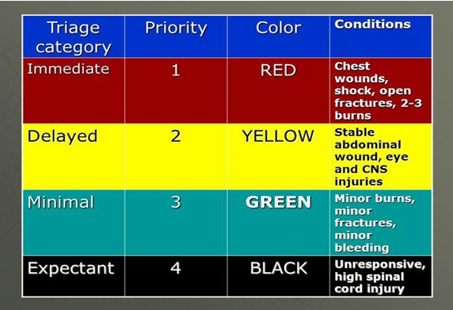

# Disaster Management – Interview and Structured Responses

---

## Interview Mail [1]

Dear Sir/Madam,

I am a student from Dhirubhai Ambani University, Gandhinagar. We would like to ask you a few questions regarding Management of resources during Man-made or Natural Disasters.

It would be grateful if you could answer a few questions which will help us in building our application (ROSHNI) for Responders like Doctors, Firefighters, NDRF and Army.

Our general questions are as follows:
1) What are the general protocols that doctors follow in case of a large scale disaster?
2) On what basis the dispatch of ambulances is carried out? (How do you decide priority?)
3) Do you also take into account the current locations of other responders? (If so, what department, for example, Firefighters, Other Doctors, NDRF..etc.)?
4) How are patients to be treated given priority?

Any other insights that you would like to specify other than these would be highly appreciated as well.

Thank you for your time and cooperation,  
Rushil Soni  
Dhirubhai Ambani University

---

## Responses from Doctors

### Dr. Riya Soni

#### 1. General Protocols
- Call for additional manpower (nurses, doctors, staff) as soon as mass casualty news arrives.  
- Begin **triage** once patients arrive, segregating based on severity and type of care (medicine, surgery, etc.).  
- Organize blood donation drives, urging relatives and staff to donate.  

#### 2. Ambulance Dispatch
- Based on **triage** — operator assesses reason for call and patient’s condition.  

#### 3. Coordination with Responders
- Coordination needed with:  
  - Other hospitals  
  - Hospital management  
  - Equipment suppliers  
  - Biomedical waste collectors  
  - Firefighters, police, politicians  
  - Blood banks and nearby hospitals  

#### 4. Patient Priority (Triage Codes)
- **Red**: Immediate treatment, high chance of survival.  
- **Yellow**: Treatment can be delayed without major risk.  
- **Green**: Minor injuries, treated after red/yellow.  
- **Black**: Dead on arrival or beyond resuscitation.  

---

### Dr. Gulam Bemat

#### 1. General Protocols
- Triage system:  
  - **Green** = Non-morbid patients  
  - **Yellow** = Morbid/moribund  
  - **Black** = Dead  

#### 2. Ambulance Dispatch
- Same triage-based priority system.  

#### 3. Coordination with Responders
- Location of responders, especially ambulances, is critical.  

#### 4. Patient Priority
- **Yellow** first  
- **Green** next  
- **Black** last  

---

## Interview Questions [2]
### Dr. Diya Katharotiya 
---
### Q1. Current Process for Receiving, Triaging, and Treating Victims  
**Answer:**  
Victims brought to the casualty center are segregated by severity:  
- **Red**: Critical (head injuries, pneumothorax) – must be treated within 6 hours.  
- **Yellow**: Not life-threatening, treated within 24 hours.  
- **Green**: Minor injuries (abrasions, fractures) – discharged after first aid.  
- **Black**: No chance of survival, not treated.  

---

### Q2. Information Needed Immediately When Alerted  
**Answer:**  
- **Exact location** and road accessibility  
- **Scale** (small vs. mass casualty)  
- **Type of disaster** (medical needs differ)  
- **Estimated victims**, with breakdown of critical vs. minor cases  

This helps prepare ambulances, trauma teams, blood, and ICU beds.  

---

### Q3. Usefulness of a Live Map (Ambulances, Clusters, Resource Centers)  
**Answer:**  
Yes. A live map is extremely useful for:  
- Dispatching nearest ambulances  
- Locating patient clusters to send staff and supplies  
- Avoiding overload of specific hospitals  

---

### Q4. Critical Real-Time Data During Disasters  
**Answer:**  
- **Medical status** (critical, moderate, minor cases)  
- **Demographics** (age, children, elderly, pregnant women)  
- **Environmental conditions** (weather, flood levels, hazards)  

---

### Q5. Usefulness of Early Warning/Prediction Systems  
**Answer:**  
Very useful. They allow:  
- Advance protocols and ambulance alerts  
- Arranging medicines and wards  
- Community measures (clean water, chlorination)  

This helps hospitals handle overwhelming admissions.  

---

### Q6. Defining Success of a Disaster Management System  
**Answer:**  
- Ability to **predict disasters** and provide timely alerts/guidelines  
- Ability to **coordinate responders efficiently** during disasters  

---

## Summary

Across all responses:  
- **Triage** is the foundation for treatment and ambulance dispatch.  
- **Coordination** among responders, hospitals, and agencies is essential.  
- **Real-time data** (location, scale, victim condition, responder locations) improves efficiency.  
- **Early warning systems** greatly enhance preparedness.  
- Success = **Prediction + Coordination**.  

---

## References

[1] Interview by **Rushil Soni**  
[2] Interview by **Dhruvil Katharotiya**
