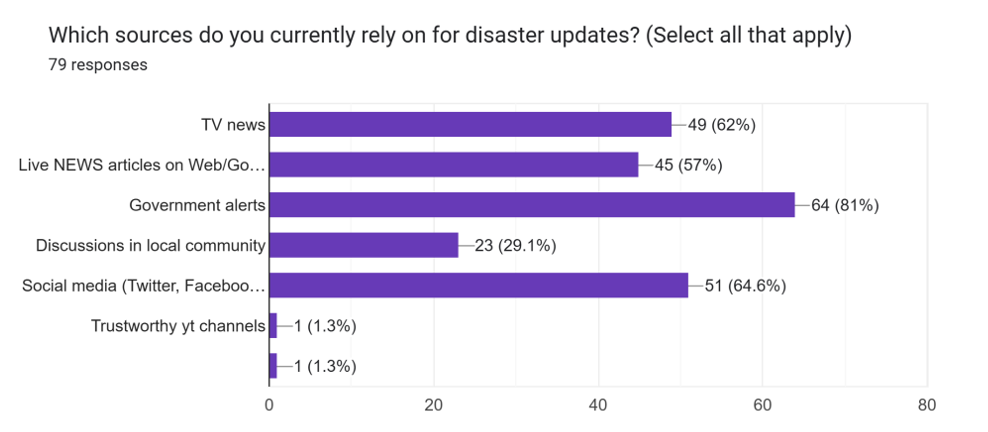
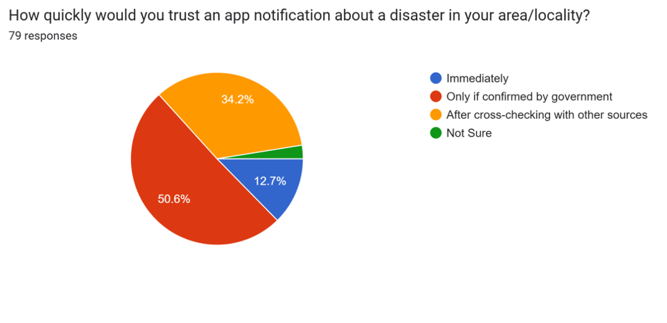
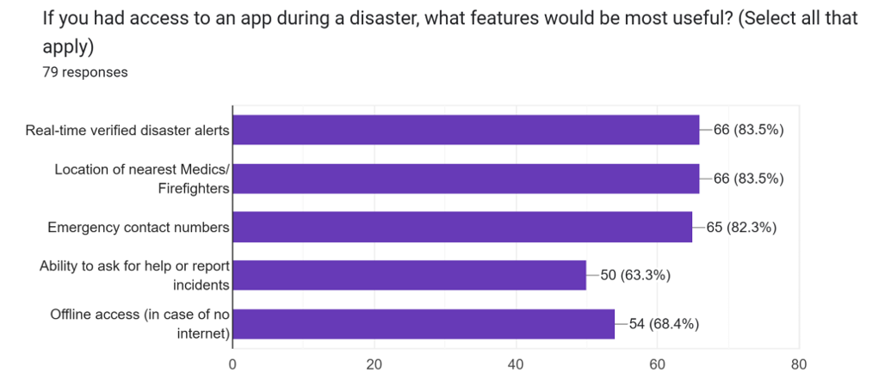
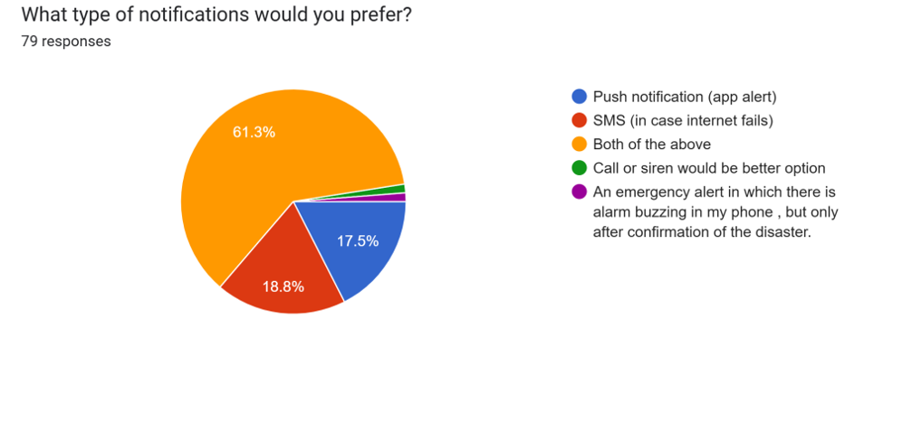

# Civilians Survey for ROSHNI Platform Group 31

---

## Question 1

### Survey Image
  

### Inference
People prioritize **quick evacuation** over other actions when faced with a disaster, though many also prefer contacting emergency services and finding shelter. This suggests a strong instinct towards immediate safety, followed by seeking help and protection.

---

---

## Question 2

### Survey Image
  

### Inference
People place the highest trust in **official government alerts**, but also actively rely on **media platforms (TV, online news, social media)** for real-time disaster information, showing a mix of official and informal information sources.

---

---

## Question 3

### Survey Image
  

### Inference
People are generally cautious about app-based disaster alerts, with the majority seeking **official government confirmation** before acting, highlighting the importance of credibility and reliability in such notifications.

---

---

## Question 4

### Survey Image
  

### Inference
Users prioritize **reliable, verified information and quick access to emergency services**, also ability to report an incident in their locality, along with features that ensure communication and functionality even without internet.

---

---

## Question 5

### Survey Image
  

### Inference
The majority of civilians prefer a confirmation notification before declaring an emergency, highlighting the need for verified and accurate alerts to reduce false alarms.

---

---

## Question 6

### Survey Image
  

### Inference
Most people want multiple alerts (both app and SMS) to ensure they don’t miss critical notifications, highlighting the importance of multiple communication channels in disaster scenarios.

---